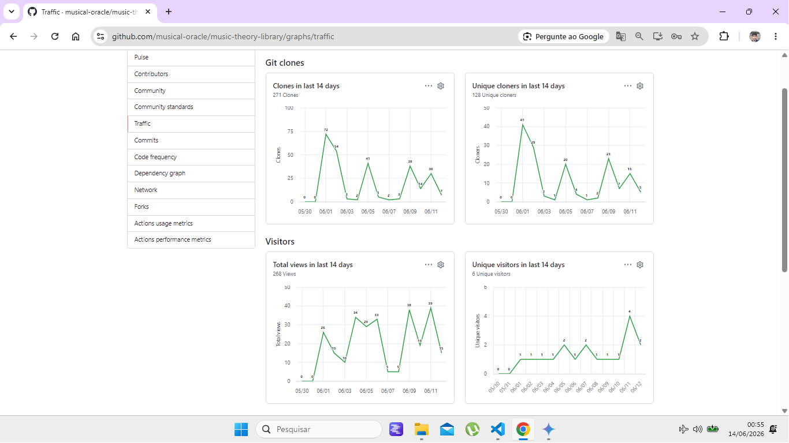
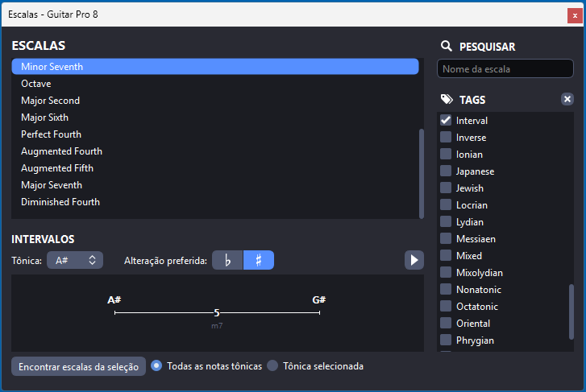
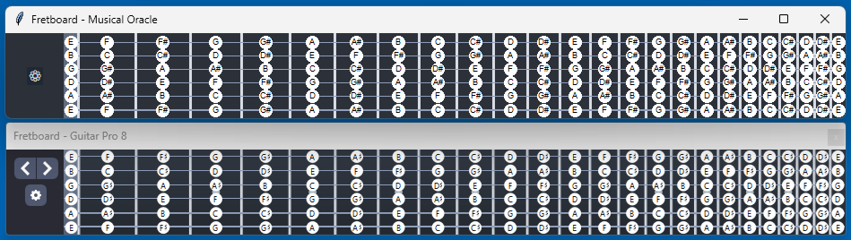

# 🔮 MUSICAL ORACLE (PYTHAGORAS)
**A MUSIC THEORY LIBRARY EQUIVALENT TO GUITAR PRO 8 (GP8)**

---
---
## 🪶 CHAPTER 1
---
---
## 🎯 SCOPE:
* Scales, chords, intervals, modes, inversions, voicings, progressions, etc.
* Library, dataset, dictionary, collection, encyclopedia, atlas, etc.
* Clean code solutions, algorithm, etc.
---
## 🚫 ZERO FRICTION:
* Download and use
* No installation
* No dependencies
* No infrastructure
* No bureaucracy.
---
## 🟢 REPOSITORY STATUS:
* **Created:** May 31, 2026.
* **Maintenance:** Almost daily.
* **Operational:** Running locally on hundreds of machines via terminal/CLI environments.
* **Reported errors:** Zero.
* **Persistent discrepancy:** High level of technical consumption accompanied by absolute social silence.
* **Consequence of the discrepancy:** The GitHub algorithm perceives the project as "stagnant," despite its active role in real technical workflows.
* **The truth:** Stars are vanity. Success is quantified by the volume of technical telemetry and by adoption — even if silent. 
---
---
## 🪶 CHAPTER 2
---
---
### 📥 DOWNLOAD FILES I
#### 🥉 Dataset V.1
👉 [music_scale_dataset.py](./music_scale_dataset.py) 
👉 [Computational Harmonic Atlas V.1 2026.pdf](./Computational%20Harmonic%20Atlas%20V.1%202026.pdf)

💡 **Technical Note:** The monopoly has ended. The database levels the playing field. The engine defines leadership.

---
### 🧬 DATASET ORIGIN
* All scales were generated 100% deterministically by the Musical Oracle engine. 
* Zero manual editing. 
* No human typos, 
* no arbitrary corrections.
---
### 📊 DATASET VOLUME
**420 MUSICAL SCALES × 17 TONIC VARIATIONS = 7,140 HARMONIC INSTANCES**

📝 **Technical Note:** Guitar Pro 8 (GP8) features 421 Musical Scales × 17 Tonic Variations = 7,157 Instances. 

📝 **Technical Note:** "Invincible is only he who does not compete." — Lao-Tzu. I can add one scale or chord per minute, yet I chose to operate with one scale fewer than the world leader.

📝 **Technical Note:** The official website claims: "Guitar Pro includes libraries containing thousands of chords and scales to develop your creativity." The user manual states : "The Scale Engine allows you to view and listen to a great number of scales in any tonality." "Guitar Pro proposes over 1000 different scales." None of these statements constitute a verifiable metric. The only way to determine the actual size of the Guitar Pro 8 library is through manual auditing. Furthermore, it appears that GP8 treats instances as if they were scales. Perhaps this is not merely terminological imprecision, but rather a device to artificially inflate the perceived size of the library. 

🔍 **Source:**
 https://www.guitar-pro.com/c/14-guitar-pro-features
 https://static.guitar-pro.com/gp8/manual/Guitar-Pro-8-user-guide.pdf (Chapter 7: Tools, p. 240)

❓**Quest:** Considering that transparency is a desirable technical virtue, why are the metrics required to verify the actual size of the library being withheld?

📝 **Technical Note:** Post-audit changes are not corrections; they are merely reactions to evidence.

---
### 🔤 DATASET TAXONOMY
The scales were organized by Cardinality (number of notes) and by Alphabetical Order within each group.

#### Scale distribution
| NUMBER OF NOTES | NUMBER OF SCALES |
| :---: | :---: |
| 3 | 4 |
| 4 | 10 |
| 5 | 88 |
| 6 | 97 |
| 7 | 149 |
| 8 | 49 |
| 9 | 15 |
| 10 | 6 |
| 11 | 0 |
| 12 | 2 |
| **TOTAL** | **420** |

📝 **Technical Note:** Eleven-note scales were omitted due to insufficient reliable references.

---
### 🧩 DATASET DIVERSITY
Structurally equivalent scales (duplicates) were included in the total count. For further details, please refer to the Computational Harmonic Atlas.The omission of duplicate structures directly alters the perceived size and effective diversity of the dataset.

#### Duplicate structures
| NUMBER OF NOTES | DUPLICATE GROUPS | STRUCTURES INVOLVED |
| :---: | :---: | :---: |
| 5 | 9 | 19 |
| 6 | 2 | 4 |
| 7 | 17 | 42 |
| 8 | 6 | 15 |
| **TOTAL** | **34** | **80** |

📝 **Technical Note:** During the audit of Guitar Pro 8 (GP8), no public documentation was found identifying, quantifying, or even acknowledging the existence of duplicate structures. Consequently, it becomes impossible to independently audit the actual size and effective diversity of the library. If transparency is considered a desirable technical virtue, why are the very data required to audit the actual size and effective diversity of the library being withheld?

---
### [🔢] DATASTE TONAL MATRIX
The Oracle generates 35 tonal variations per scale. However, this edition deliberately presents only 17 tonal variations per scale, selected according to conventional market standards to enable direct comparison with currently available solutions. 

| NATURAL | SHARP | FLAT | DOUBLE SHARP | DOUBLE FLAT |
| :---: | :---: | :---: | :---: | :---: |
| `C` | `C#` | ❌ | ❌ | ❌ |
| `D` | `D#` | `Db` | ❌ | ❌ |
| `E` | ❌ | `Eb` | ❌ | ❌ |
| `F` | `F#` | ❌ | ❌ | ❌ |
| `G` | `G#` | `Gb` | ❌ | ❌ |
| `A` | `A#` | `Ab` | ❌ | ❌ |
| `B` | ❌ | `Bb` | ❌ | ❌ |

---
### 🛠️ DATASET STRUCTURE
#### 🆔 Structural identification:
* **Structure Name:** `Major`
* **Structure Classification (Optional):** `Scale`

💡 **Scalability (Optional):** Include a geographic origin field (country or historical continent: Africa, Asia, Europe, etc.). Detail: the continental approach is easier to implement.

#### 🌱 Structural seeds:
* **Step Pattern:** `2, 2, 1, 2, 2, 2, 1`
* **Intervals (Ascending):** `P1, M2, M3, P4, P5, M6, M7, P8`

📝 **Technical Note:** Semitone = 1, Tone = 2. 
📝 **Technical Note:** Replacing 1 with ½, and 2 with 1, is done in the interface.

#### 🎼 Generated output:
* `C, D, E, F, G, A, B, C`
* `C#, D#, E#, F#, G#, A#, B#, C#`
* `...`

#### 🐍 Python implementation:

```python

MUSIC_SCALE_DATASET = { 
 'Major': {'classification': 'Scale',
           'step_pattern': (2, 2, 1, 2, 2, 2, 1),
           'intervals': ('P1', 'M2', 'M3', 'P4', 'P5', 'M6', 'M7', 'P8'),
           'instances': {'C': ('C', 'D', 'E', 'F', 'G', 'A', 'B', 'C'),
                          'C#': ('C#', 'D#', 'E#', 'F#', 'G#', 'A#', 'B#', 'C#'),
                          'Db': ('Db', 'Eb', 'F', 'Gb', 'Ab', 'Bb', 'C', 'Db'),
                          'D': ('D', 'E', 'F#', 'G', 'A', 'B', 'C#', 'D'),
                          'D#': ('D#', 'E#', 'F##', 'G#', 'A#', 'B#', 'C##', 'D#'),
                          'Eb': ('Eb', 'F', 'G', 'Ab', 'Bb', 'C', 'D', 'Eb'),
                          'E': ('E', 'F#', 'G#', 'A', 'B', 'C#', 'D#', 'E'),
                          'F': ('F', 'G', 'A', 'Bb', 'C', 'D', 'E', 'F'),
                          'F#': ('F#', 'G#', 'A#', 'B', 'C#', 'D#', 'E#', 'F#'),
                          'Gb': ('Gb', 'Ab', 'Bb', 'Cb', 'Db', 'Eb', 'F', 'Gb'),
                          'G': ('G', 'A', 'B', 'C', 'D', 'E', 'F#', 'G'),
                          'G#': ('G#', 'A#', 'B#', 'C#', 'D#', 'E#', 'F##', 'G#'),
                          'Ab': ('Ab', 'Bb', 'C', 'Db', 'Eb', 'F', 'G', 'Ab'),
                          'A': ('A', 'B', 'C#', 'D', 'E', 'F#', 'G#', 'A'),
                          'A#': ('A#', 'B#', 'C##', 'D#', 'E#', 'F##', 'G##', 'A#'),
                          'Bb': ('Bb', 'C', 'D', 'Eb', 'F', 'G', 'A', 'Bb'),
                          'B': ('B', 'C#', 'D#', 'E', 'F#', 'G#', 'A#', 'B')}}}
```
---
### 🪶 DATASET NOTATION RULES
The notation adopted is strictly theoretical. Example: `E#` is not replaced with `F`.

📝 **Technical Note:** Although the theoretical notation approach reduces readability, it prevents harmonic paradoxes and interval inconsistencies. For further details, consult the document 'System Necropsy'.

📝 **Technical Note:** Notational simplifications must be handled exclusively at the upper layer (interface).

---
### 🏁 DATASET BENCHMARK
#### Musical Oracle 🆚 Guitar Pro 8 (GP8)
<table style="width: auto; border-collapse: collapse; font-family: sans-serif;">
  <tbody>
    <tr>
      <td><b>Correspondence</b></td>
      <td>Full</td>
    </tr>
    <tr>
      <td><b>Exceptions</b></td>
      <td>Guitar Pro 8 (GP8) notation simplifications</td>
    </tr>
  </tbody>
</table>

📝 **Technical Note:** The complete comparison between the systems will not be disclosed for now, to avoid embarrassment regarding the current state of the art.

---
### 📈 DATASET INTERVALS
#### Volumetric summary
| METRIC | VALUE |
| :--- | :--- |
| Total structures analyzed | 420 |
| Total interval occurrences | 3148 |
| Distinct interval types | 20 |

#### Interval distribution
| INTERVAL | OCCURRENCES |
| :--- | :--- |
| `P1` | 420 |
| `Aug1` | 3 |
| `m2` | 156 |
| `M2` | 208 |
| `Aug2` | 14 |
| `m3` | 183 |
| `M3` | 206 |
| `dim4` | 7 |
| `P4` | 245 |
| `Aug4` | 56 |
| `dim5` | 139 |
| `P5`| 299 |
| `Aug5` | 16 |
| `m6` | 180 |
| `M6` | 198 |
| `Aug6` | 12 |
| `dim7` | 5 |
| `m7` | 195 |
| `M7` | 186 |
| `P8` | 420 |

#### Frequency ranking
| RANK | INTERVAL | OCCURRENCES |
| :---: | :--- | :--- |
| 1 | `P1` | 420 |
| 2 | `P8` | 420 |
| 3 | `P5` | 299 |
| 4 | `P4` | 245 |
| 5 | `M2` | 208 |
| 6 | `M3` | 206 |
| 7 | `M6` | 198 |
| 8 | `m7` | 195 |
| 9 | `M7` | 186 |
| 10 | `m3` | 183 |
| 11 | `m6` | 180 |
| 12 | `m2` | 156 |
| 13 | `dim5` | 139 |
| 14 | `Aug4` | 56 |
| 15 | `Aug5` | 16 |
| 16 | `Aug2` | 14 |
| 17 | `Aug6` | 12 |
| 18 | `dim4` | 7 |
| 19 | `dim7` | 5 |
| 20 | `Aug1` | 3 |

📝 **Technical Note:** P1 and P8 occur in all structures; therefore, they should be excluded from analytical ranking.

📝 **Technical Note:** Use this table to assist in anticipating melodic movements and structural patterns with greater mathematical precision.

#### Interval legend
| Notation | Full Name |
| :---: | :--- |
| `P1` | Perfect Unison |
| `Aug1` | Augmented Unison |
| `m2` | Minor Second |
| `M2` | Major Second |
| `Aug2` | Augmented Second |
| `m3` | Minor Third |
| `M3` | Major Third |
| `dim4` | Diminished Fourth |
| `P4` | Perfect Fourth |
| `Aug4` | Augmented Fourth |
| `dim5` | Diminished Fifth |
| `P5` | Perfect Fifth |
| `Aug5` | Augmented Fifth |
| `m6` | Minor Sixth |
| `M6` | Major Sixth |
| `Aug6` | Augmented Sixth |
| `dim7` | Diminished Seventh |
| `m7` | Minor Seventh |
| `M7` | Major Seventh |
| `P8` | Perfect Octave |

---
### ⚔️ GLOBAL CHALLENGE
> I CHALLENGE. EVERY MUSICIAN AND DEVELOPER ON THE PLANET. **FIND A SINGLE NOTATION ERROR THAT CONTRADICTS THE UNDERLYING THEORY.** THERE ARE OVER **7,000 CHANCES** TO PROVE ME WRONG. **GOOD LUCK.**

📝 **Technical Note:** To facilitate verification, the use of music software is recommended—such as Guitar Pro (GP8)—as both systems share the same scales in the same keys. For automated validation, use `music_scale_dataset.py`.

#### Status
📅 **Launch Date:** May 31, 2026 (the same day i created this repository).
🚫 **Reported Errors:** Zero.

📝 **Technical Note:** *"Non-action is also an action." — Liezi.* This material has already undergone scrutiny by some of the most capable individuals in the field; if there were a single incorrect note, it would already have been detected and reported.

---
### 👁️ WHAT IF I FIND ONE WRONG NOTE??
**Finding an error in the Oracle is equivalent to finding an error in music theory itself.** 

📝 **Analogy:** if a calculator correctly computes 1 × 1, it will also correctly compute 12345 × 67890. Therefore, changing the values does not alter the logic. 

📝 **Technical Note:** Any eventual errors are associated exclusively with poor computational implementation—for example, inconsistencies within the database—and never with the theorem itself. However, should the impossible occur—that is, if the error originates from the theorem itself—this would still not compromise its value, because the system would remain, by a wide margin, more precise than the solutions currently available on the market. Furthermore, due to its lean and deterministic logical core, any flaw would be detectable, isolatable, and correctable. Therefore, the theorem is not founded upon an unrealistic promise of absolute perfection, but rather upon consistency and capacity for evolution, remaining technically superior even in the presence of eventual imperfections.

----
----
## 🪶 CHAPTER 3
---
---
### 🗝️ PROPRIETARY LICENSE
**Copyright (c) 2026 Átila Lopes Coelho**

**Version 1.0**  
**Effective Date:** May 2026

**All Rights Reserved.**

This repository and all of its contents, including but not limited to:

- source code;
- scripts;
- algorithms;
- datasets;
- knowledge bases;
- documentation;
- harmonic atlases;
- diagrams;
- conceptual models;
- taxonomies;
- ontologies;
- classifications;
- data structures;
- texts;
- images;
- tables;
- research materials;
- methodologies;
- architectures;
- technical specifications;
- educational materials;
- and any other content contained herein,

are protected under applicable national and international copyright and intellectual property laws and are the exclusive property of **Átila Lopes Coelho**.

**PERMISSIONS**

The following activities are exclusively permitted:

1. Viewing the content;
2. Studying the content;
3. Sharing the content in its complete and unmodified form;

provided that all of the following conditions are met:

**a)** the author's full identification is preserved;
**b)** this license notice remains intact;
**c)** clear and visible attribution is given to **Átila Lopes Coelho**;
**d)** no direct or indirect commercial purpose exists;
**e)** no modifications, adaptations, translations, transformations, derivative works, fragmentations, or modified redistributions are made.

**RESTRICTIONS**

Unless prior express written authorization is obtained from the rights holder, the following actions are prohibited:

1. Using the content for commercial purposes;
2. Selling, licensing, sublicensing, or monetizing, in whole or in part, any content contained in this repository;
3. Incorporating any portion of the content into commercial products, services, platforms, or solutions;
4. Removing, concealing, or altering authorship attribution;
5. Creating derivative works or adaptations;
6. Repackaging, reorganizing, or redistributing the content under another identity;
7. Using the content for the training, fine-tuning, distillation, validation, evaluation, or development of artificial intelligence models, machine learning systems, or automated systems;
8. Using the datasets, structures, classifications, taxonomies, ontologies, or knowledge bases provided herein to create competing or derivative products;
9. Presenting all or part of the content as one's own creation.

**RESERVATION OF RIGHTS**

The public availability of this repository shall not be construed as an assignment, transfer, waiver, or unrestricted license of any intellectual property rights.

All rights not expressly granted herein are reserved by the author.

**DISCLAIMER OF WARRANTIES**

The content is provided **"AS IS"**, without warranties of any kind, whether express or implied.

**CONTACT**

Requests for commercial licensing, special authorization, or additional permissions must be submitted directly to the author.

**Email:** atilalopescoelho@gmail.com

**Átila Lopes Coelho**

**2026**

---
### 👋 FEEDBACK:
**IF YOU FOUND THIS PROJECT GOOD, USEFUL, AND TRUE, PLEASE CONSIDER:**
* ⭐ Leaving a **Star** on the repository.
* 🍴 **Forking** the project.
* 🐛 Reporting **Issues**.
* 🔀 Contributing with **Pull Requests** / improvements.
* 📢 **Sharing** it with others.

🔗 **REPOSITORY LINK:** https://github.com/musical-oracle/music-theory-library

---
### 🤖 THE ALGORITHM PARADOX
**The launch of Musical Oracle was a success.** The content is already running locally on multiple machines through terminal/CLI environments. In less than two weeks online, the project reached 271 clones, 128 unique cloners, 268 views, and 6 unique visitors, distributed across 5 engagement peaks. This is a remarkable result for such a short period of exposure, especially considering the highly specialized nature of the content and the fact that it was created by a complete unknown.



The 5 peaks observed in the chart above validate the hypothesis of recurring and integrated usage, indicating that the project did not experience a temporary traffic spike, but rather a continuous cycle of technical adoption. Even so, the repository received zero organic stars. (Although the page displays three stars, they were given by the author, the author's spouse, and a close friend, and were therefore excluded from the statistics.) The first wave of downloads appears to have originated predominantly from specialists within the music software ecosystem. Although this cannot be verified, the hypothesis is consistent with the high volume of clones observed after publication and with the typical behavior of technical communities. Every developer knows that starring a repository is the primary way to signal to platform algorithms that a project is valuable and deserves greater visibility. However, that did not happen. Consequently, to the GitHub algorithm, the project appears dead, even though it is already in use. The data show that technical recognition preceded social validation. Regardless of the reasons, consumption occurred; recognition did not. This behavior had already been anticipated and documented months before publication. The observed pattern is now formally documented. Therefore, given the absence of even minimal, publicly demonstrable reciprocity from the community, new content will be released strictly on demand, according to the level of engagement and reaction observed on this page. I am ready to deliver the ocean. The community is choosing the drop. Therefore, keep the drop.

----
----
## 🪶 CHAPTER 4
---
---
### 📥 DOWNLOAD II
🔓 **UNLOCK AT 5.000 STARS** ⭐
#### 🥈 Dataset V.2
**52 CHORDS × 17 TONIC VARIATIONS = 884 INSTANCES**

📝 **Technical Note:** Guitar Pro 8 (GP8) features 20 Chords × 17 Tonic Variations = 340 Instances.

📝 **Technical Note:** Inversions were not included in the count.

---
### 📥 DOWNLOAD III:
🔓 **UNLOCK AT 10.000 STARS** ⭐
#### 🥇 Dataset V.3
**52 CHORDS × 35 TONIC VARIATIONS = 1,820 INSTANCES** 

---
### 📥 DOWNLOAD IV:
🔓 **UNLOCK AT 20.000 STARS** ⭐
#### 💎 Dataset V.4
**420 MUSICAL SCALES × 35 TONIC VARIATIONS = 14,700 INSTANCES**

---
### 📥 DOWNLOAD V: 
🔓 **UNLOCK AT 50.000 STARS** ⭐
#### 👑 Dataset V.5
**X STRUCTURES (2 TO 12 NOTES) × 35 TONIC VARIATIONS = X INSTANCES**

📝 **Technical Note:** This will be the largest collection of harmonic structures in human history. Billions or trillions of structures, automatically generated. I do not compute the limits of combinatorics; I merely guarantee that every output will be mathematically flawless—validated in real-time by an engine sustained by an original theorem, materialized in just 35 lines of code, properly isolated. The question is whether the technical community is capable of processing this paradigm or if it will continue feigning ignorance just to deny credit to the author. Market giants already recognize the obsolescence of their models; their silence is a containment strategy. If this development were discontinued, the sector's advancement would stagnate. It would then fall to the giants to attempt to formulate an equivalent theorem—a cognitive brute-force gamble that could take eras, given the non-trivial nature of the insight required. Even if they miraculously stumble upon a solution, a lack of architectural elegance will be inevitable. Without a central theorem, they remain hostages to incomplete databases, low-fidelity heuristics, and a lack of calculation persistence. It is a fragmented system that imposes a constant cognitive burden on the user—mental recalculation—turning the paying client into a failure auditor. The complete autopsy of this structural bankruptcy is detailed in the Multidisciplinary Technical Dossier (Necropsy).

📝 **Technical Note:** This document is not a marketing artifact; it is the formal record of a technical fact and the establishment of a temporal milestone. Possessing nanocode capable of validating infinity in real-time requires no narrative—one only needs to expose the technological abyss that separates mathematical certainty from the empirical determinism of the current market.

----
----
## 🪶 CHAPTER 5
---
---
### 📥 DOWNLOAD VI:
#### ⚙️ ENGINEERING MANUALS:
🔓 **UNLOCK AT 25.000 STARS** ⭐

🧠 **Back-End:**
* 👉 [Automatic Validation System](#automatic-validation-system-engineering)
* ❌ A harmonic generator.
* A deterministic bidirectional interval analyzer. 
* 👉 [Scale Modes](#scale-modes)
* 👉 [Chord Inversions](#chord-inversions)
* Chord voicings (Drop 2).
* Chord voicings (Drop 3).
* Chord voicings (Drop 2-4).
* Scale harmonization.
* Chord progressions.

🎨 **Front-End (Interface):**
* A scale dictionary.
* An interval analyzer.
* A hybrid interface (scales, chords, and intervals).

⚡**Advanced Features:**
* A mini MIDI system.
* A fretboard similar to Guitar Pro 8 (GP8).
* A sheet music and tablature editor similar to Guitar Pro 8 (GP8).
---
### 📥 DOWNLOAD VII:
#### 🧮 CALCULATION MEMORANDUM
🔓 **UNLOCK AT 25.001 STARS** ⭐
* ❌ Scales and chords.
* Intervals.
---
### 📥 DOWNLOAD VIII
#### 💀 THE DARK SIDE OF THE FORCE
🔓 **UNLOCK AT 30.000 STARS** ⭐
* A multidisciplinary technical dossier

📝 **Technical Note:** A Necropsy of the System (music theory, computing, automation, pedagogy, ethics, morality, law, reputation, business, psychology, interface, etc.).

* An asphyxia protocol — friction dissipation pipeline (FDP).
* A majin buu protocol — silent assimilation of contributions pipeline (SACP).
---
### 📥 DOWNLOAD VIIII
#### 💥 AUDITING & QUESTIONNAIRES
🔓 **UNLOCK AT 30.001 STARS** ⭐
* Traceability and Technical Auditing
* Questionnaire I: Quality and limitations of music software.
----
----
## 🪶 CHAPTER 6
---
---
### THE PROJECT CORE
---
---
### 🏷️ ID
* **Author:** Átila Lopes Coelho
* **Launch Date:** May 31, 2026
* **Commercial Name:** Musical Oracle (Pythagoras)
* **Technical Name:** Universal Deterministic Harmonic Generator (UDHG)
---
### 🧭 DESCRIPTION
The Oracle or UDHG is sustained by a proprietary musical theorem, capable of generating harmonic structures (scales, chords, and intervals) 100% deterministically and in real-time (zero lookups, tricks, or subterfuges). The system operates across any cardinality (from 2 to X notes) in all 35 tonic variations, with 99.999% precision, sustained by a calculation memorandum (didactic like a teacher, transparent like a bank statement) — integrated into an automated validation system with correction suggestion mechanisms (based on critical-system architectures).

📝 **Technical Note:** The engine is 100% deterministic, yet I adopt a metric of 99.999%. This is a strictly philosophical choice: to me, only God is 100%.

---
### ⚠️ TECHNICAL LIMITATIONS
The system does not operate with microtonal structures. (I know the theory, but unfortunately, not all of it).

---
### ⚙️ IMPLEMENTATION
#### Nature of the system.
The Oracle can be described as a quasi-DSL (Domain-Specific Language), as it already encapsulates the semantic rules of the musical domain, although it does not yet possess its own formal syntax.

📝 **Technical Note:** The Oracle was developed absolutely from scratch using only native language features. Therefore, it does not depend on external libraries, frameworks, or specialized packages.

#### Core architecture
| COMPONENT | SPECIFICATION |
| :--- | :--- |
| Language | Python |
| Design | Independent Modules |
| Database (Structural Seeds) | 147KB – 1,768 Lines of Code |
| Interface (Optional) | 96KB – 2,177 Lines of Code |
| Kernel | 25KB – 430 Lines of Code |

#### Kernel code distribution.
| COMPONENT | SPECIFICATION |
| :--- | :--- |
| Imports | 4 Lines of Code |
| Constants | 16 Lines of Code |
| Infrastructure<br>(TypedDict, Dataclass, Input Resolver, etc.) | Remaining Lines |
| Self-Validation (Optional) | 78 Lines of Code |
| Structural Calculation (Properly Isolated) | 35 Lines of Code |

📝 **Technical Note:** The theorem responsible for generating musical structures is materialized in just 35 lines of code. Everything else constitutes standard software infrastructure and contains no relevant musical logic.

---
### 📈 PERFORMANCE
#### Test environment
| COMPONENT | SPECIFICATION |
| :--- | :--- |
| Hardware | Lenovo Ideapad S145 |
| Processor | Intel i5-1035G1 |
| Memory | 4 GB of RAM |
| System | Windows 11 |

📝 **Technical Note:** Tests were performed on an entry-level, low-specification laptop.

#### Performance metrics
| METRIC | RESULT |
| :--- | :--- |
| Generation & Validation Precision | 99.999% |
| Average Response Time | < 0.4399 ms |
| Memory Consumption | < 4.85 KB |

📝 **Technical Note:** The current codebase has not yet undergone an advanced optimization process. Consequently, there remains significant potential to reduce code size, improve memory efficiency, and bring processing time closer to its theoretical minimum.

---
### 🚀 SCALABILITY
#### Atlas v.1 published capacity.
| ENTITY | VOLUME |
| :--- | :--- |
| Scales | 420 |
| Tonic Variations | x 17 |
| Instances | 7,140 |

#### Current oracle capacity
| ENTITY | VOLUME |
| :--- | :--- |
| Scales | 420 |
| Tonic Variations | x 35 |
| Generated Instances | 14,700 |

#### Theoretical oracle capacity.
| ENTITY | VOLUME |
| :--- | :--- |
| Scales | Unbounded |
| Tonic Variations | x 35 |
| Generated Instances | Unbounded |

📝 **Technical Note:** Average time required to register a scale and verify the 35 variations: between 1 and 5 minutes.

----
----
## 🪶 CHAPTER 7
---
---
### HARMONIC STRUCTURES
---
---
### 👣 SEMITONE, TONE
#### 🧭 Definition
* "The semitone is the smallest interval adopted between two notes in Western music (equal temperament system)." Bohumil Med – Teoria da Música, 5th edition, 2017, p.30.
* "The tone is the sum of two semitones." Bohumil Med – Teoria da Música, 5th edition, 2017, p.31.
#### ⚖️ Value
* Semitone = 1
* Tone = 2

📝 **Technical Note:** replacing 1 with ½, and 2 with 1, is done in the interface.

---
### 📐 INTERVALS
#### 🧭 Definition:
"pitch difference between two sounds. relationship between two pitches. space that separates one sound from another." Bohumil Med – Teoria da Música, 5th edition, 2017, p.60.

#### [🔢] Interval Matrix
| QUANTITATIVE INTERVALS | QUALITATIVE INTERVALS |
| :--- | :--- | 
| 1, 4, 5, 8 | P |
| 2, 3, 6, 7 | m |
| 2, 3, 6, 7 | M |
| 2, 3, 6, 7 | dim, SD or 2xD, 3xD, 4xD, 5xD, 6xD, 7xD, 8xD, 9xD, 10xD, 11xD |
| 2, 3, 6, 7 | Aug, SA or 2xA, 3xA, 4xA, 5xA, 6xA, 7xA, 8xA, 9xA, 10xA, 11xA |

📝 **Technical Note:** According to the rules and conventions of music theory, "theoretically, it is possible to form triple, quadruple, and quintuple augmented and diminished intervals" (Bohumil Med, Teoria da Música, 5th edition, 2017, p. 72).

📝 **Technical Note:** To cover extreme cases, the interval matrix was deliberately expanded to eleven times augmented (11xA) or diminished (11xD).

---
### [🔢] TONAL MATRIX
The tonal matrix is theoretically infinite, but to follow rules and conventions it was limited to double sharps and flats.

| NATURAL | SHARP | FLAT | DOUBLE SHARP | DOUBLE FLAT |
| :---: | :---: | :---: | :---: | :---: |
| `C` | `C#` | `Cb` | `C##` | `Cbb` |
| `D` | `D#` | `Db` | `D##` | `Dbb` |
| `E` | `E#` | `Eb` | `E##` | `Ebb` |
| `F` | `F#` | `Fb` | `F##` | `Fbb` |
| `G` | `G#` | `Gb` | `G##` | `Gbb` |
| `A` | `A#` | `Ab` | `A##` | `Abb` |
| `B` | `B#` | `Bb` | `B##` | `Bbb` |

📝 **Technical Note:** The Oracle generates 35 tonal variations per scale. However, this edition deliberately presents only 17 tonal variations per scale, selected according to conventional market standards to enable direct comparison with currently available solutions. 

---
### 🎵 MUSICAL SCALES
#### 🧭 Definition:
* “Scale – is an ascending and descending succession of different and consecutive notes; it is the set of notes available in a given musical system; it is an ordered succession of sounds, contained within the limit of an octave.” Bohumil Med – Teoria da Música, 5th edition, 2017, p.83.
* “Scale is a series of ascending or descending sounds in which the last will be the repetition of the first, an octave above or below.” Almir Chediak – Harmonia e Improvisação, volume 1, 1986, p.63.
* “notes heard successively form a series of sounds to which the name scale is given.” Maria Luísa de Mattos Priolli – Princípios Básicos da Música para a Juventude, volume 1, p.7.
* “A series of single notes progressing up or down stepwise. Thus, a series of notes within an octave.” The Concise Oxford Dictionary of Music (5 ed.), available at: https://www.oxfordreference.com/view/10.1093/oi/authority.20110803100444215?rskey=d8Ly7a&result=4
* “Scale, in music, any graduated sequence of notes, tones, or intervals dividing what is called an octave.” Encyclopedia Britannica online, available at: https://www.britannica.com/art/scale-music

---
🚧 This section is currently under development. 🚧
### 🎵 SCALES - MODES
#### 🧭 Definition:
Modes are a consequence of the rotation of a scale.

#### ⚙️ Algorithm:
**Step 1:** Generate a scale or retrieve one from a dataset.

**Example Scale:** 
* `C, D, E, F, G, A, B, C`

**Step 2:** Remove the octave from the structure.

**Example of Scale Without Octave:** 
*  `C, D, E, F, G, A, B`

📝 **Technical Note:** Do not simply remove the last element of the list. First, verify whether the last note is equal to the first note. Only in this case should the last element be treated as an octave and removed.

📝 **Technical Note:** If the octave is not removed, all generated modes will contain a duplicate note.

**Example (Incorrect Rotation):**
* 1: `C, D, E, F, G, A, B, C`
* 2: `D, E, F, G, A, B, C, C`
* 3: `E, F, G, A, B, C, C, D`
* 4: `F, G, A, B, C, C, D, E`
* 5: `G, A, B, C, C, D, E, F`
* 6: `A, B, C, C, D, E, F, G`
* 7: `B, C, C, D, E, F, G, A`

**Step 3:** Rotate the notes of the scale. Each rotation generates a mode.

**Example:**
* 1: `C, D, E, F, G, A, B`
* 2: `D, E, F, G, A, B, C`
* 3: `E, F, G, A, B, C, D`
* 4: `F, G, A, B, C, D, E`
* 5: `G, A, B, C, D, E, F`
* 6: `A, B, C, D, E, F, G`
* 7: `B, C, D, E, F, G, A`

**Step 4:** Reintroduce the octave into each generated mode.

**Example:**
* 1: `C, D, E, F, G, A, B, C`
* 2: `D, E, F, G, A, B, C, D`
* 3: `E, F, G, A, B, C, D, E`
* 4: `F, G, A, B, C, D, E, F`
* 5: `G, A, B, C, D, E, F, G`
* 6: `A, B, C, D, E, F, G, A`
* 7: `B, C, D, E, F, G, A, B`

<span id="scale-modes-implementation">🛠️ **IMPLEMENTATION**</span>

**Step 5:** Display the results in the user interface.

**Example:** 
* Create a table with two columns: one for the mode name and another for the mode notes. Mode names may be generic (Mode 1, Mode 2, ...) or specific (Ionian, Dorian, ...).

| Mode | Notes |
| :---: | :--- |
| 1 | `C, D, E, F, G, A, B, C` |
| 2 | `D, E, F, G, A, B, C, D` |
| 3 | `E, F, G, A, B, C, D, E` |
| 4 | `F, G, A, B, C, D, E, F` |
| 5 | `G, A, B, C, D, E, F, G` |
| 6 | `A, B, C, D, E, F, G, A` |
| 7 | `B, C, D, E, F, G, A, B` |

📝 **Technical Note:** Generic names are simpler and faster to implement. In addition, they are more universal and independent of any specific music theory.

📝 **Technical Note:** Inform users that modes are simply rotations of the scale. Although the results are mathematically correct, not all generated structures are necessarily valid from a music theory perspective. For more information regarding musical application and theoretical validity, consult a musician or a music theory reference.

---
#### 🐍 Python implementation
📝 **Technical Note:** This implementation should not be considered a definitive reference. Its purpose is to demonstrate the algorithm in a simple and readable manner.

```python

def _generate_scale_modes(self, notes: tuple[str, ...]) -> tuple[tuple[str, ...], ...]:
    """
    Generates the modes of a scale through rotations.

    Algorithm:
      1. Checks whether the scale ends on the octave and, if so, removes it.
      2. Rotates the remaining notes.
      3. Reintroduces the octave into each generated mode.

    Notes:
      - Applies only to structures classified as scales.
      - Modes receive generic names (Mode 1, Mode 2, ...).
      - Specific names (Ionian, Dorian, Phrygian, etc.)
        are handled by the interface layer.
    """

    # Step 1 — Verify and remove the octave, if present.
    if len(notes) > 1 and notes[0] == notes[-1]:
        scale_without_octave = notes[:-1]
    else:
        scale_without_octave = notes

    # Step 2 — Rotate the remaining notes.
    modes_without_octave = tuple(
        scale_without_octave[i:] + scale_without_octave[:i]
        for i in range(len(scale_without_octave))
    )

    # Step 3 — Reintroduce the octave into each generated mode.
    modes_with_octave = tuple(
        mode + (mode[0],)
        for mode in modes_without_octave
    )

    return modes_with_octave

def get_output_notes(self, notes: list[str]) -> list[str]:
    """Defines the note output format (with or without spelling simplification)."""
    if self.simplify_spelling_check_var.get():
        return list(self.spelling_controller.simplify_notes(tuple(notes)))
    return notes

def _build_modes_display(self, scale_modes):
    """
    Prepares modes for display.

    Algorithm:
      1. Receives the generated modes.
      2. Normalizes the notes for display according to the active configuration.
      3. Returns the modes ready for formatting.

    Notes:
      - May apply note spelling simplification depending on the active configuration.
      - Does not generate, remove octaves, or rotate modes.
    """

    # Step 1 — Return empty if no modes exist.
    if not scale_modes:
        return scale_modes

    # Step 2 — Convert each mode to the configured output format.
    return tuple(
        self.get_output_notes(list(mode))
        for mode in scale_modes
    )

def format_modes(self, modes: Optional[tuple[tuple[str, ...], ...]]) -> str:
    """
    Formats modes for textual display.

    Algorithm:
      1. Receives the modes prepared for display.
      2. Numbers each mode sequentially.
      3. Converts each mode's notes into text.
      4. Builds a textual table.

    Notes:
      - Uses generic numeric names: 1, 2, 3, ...
      - The table is generated using the 'fancy_grid' format.
    """

    # Step 1 — Return an empty string if no modes exist.
    if not modes:
        return ''

    # Step 2 — Build the table data.
    table_data = [
        [index, ', '.join(mode)]
        for index, mode in enumerate(modes, start=1)
    ]

    # Step 3 — Generate the textual table.
    table = tabulate(
        table_data,
        tablefmt='fancy_grid',
        showindex=False,
    )

    # Step 4 — Return the formatted text block.
    return f'MODES (Rotations)\n{table}\n\n'

def _display_result_textbox(self, message: str) -> None:
    """
    Displays formatted text in the main panel.

    Algorithm:
      1. Checks whether the text widget exists.
      2. Temporarily enables editing.
      3. Clears the previous content.
      4. Inserts the new text.
      5. Disables editing again.
    """

    try:
        # Step 1 — Verify that the text widget exists.
        if self.result_text and self.result_text.winfo_exists():

            # Step 2 — Temporarily enable editing.
            self.result_text.config(state="normal", font=("Courier", 10))

            # Step 3 — Clear previous content.
            self.result_text.delete("1.0", tk.END)

            # Step 4 — Insert new content.
            self.result_text.insert(tk.END, message, "center")

            # Step 5 — Disable editing again.
            self.result_text.config(state="disabled")

    except (tk.TclError, AttributeError):
        pass

```
📝 **Technical Note:** The interface may apply display adjustments to notes before final formatting. These adjustments do not modify the generated modes; they only affect how the modes are presented to the user.

📝 **Technical Note:** The `tabulate` library is temporarily being used for convenience — it was kept exclusively to serve as an example of what not to do. The architectural goal is to have zero third-party dependencies whenever possible.

📝 **Technical Note:** If you were able to understand how this implementation works, then you have a moral obligation to build something much better than this.

---
🚧 This section is currently under development. 🚧
### HARMONIZED SCALE
---
🚧 This section is currently under development. 🚧
### CHORDS
---
🚧 This section is currently under development. 🚧
### CHORDS-INVERSIONS
#### 🧭 Definition:
Inversions are a consequence of the rotation of a chord.
#### ⚙️ Algorithm:
Utilizes the same logic as modes, but adapted for chords.
| Root Position | Root | 3rd | 5th | 7th |
| :--- | :---: | :---: | :---: | :---: |
| 1st Inversion | 3rd | 5th | 7th | Root |
| 2nd Inversion | 5th | 7th | Root | 3rd |
| 3rd Inversion | 7th | Root | 3rd | 5th |

---
🚧 This section is currently under development. 🚧
### CHORD VOICINGS
---
🚧 This section is currently under development. 🚧
#### Drop 2
| Root Position | Root | 5th | 7th | 3rd |
| :--- | :---: | :---: | :---: | :---: |
| 1st Inversion | 3rd | 7th | Root | 5th |
| 2nd Inversion | 5th | Root | 3rd | 7th |
| 3rd Inversion | 7th | 3rd | 5th | Root |

---
🚧 This section is currently under development. 🚧
#### Drop 3
| Root Position | Root | 7th | 3rd | 5th |
| :--- | :---: | :---: | :---: | :---: |
| 1st Inversion | 3rd | Root | 5th | 7th |
| 2nd Inversion | 5th | 3rd | 7th | Root |
| 3rd Inversion | 7th | 5th | Root | 3rd |

---
🚧 This section is currently under development. 🚧
#### Drop 2-4
| Root Position | Root | 5th | 3rd | 7th |
| :--- | :---: | :---: | :---: | :---: |
| 1st Inversion | 3rd | 7th | 5th | Root |
| 2nd Inversion | 5th | Root | 7th | 3rd |
| 3rd Inversion | 7th | 3rd | Root | 5th |

---
🚧 This section is currently under development. 🚧
### CHORD PROGRESSIONS
----
----
## 🪶 CHAPTER 8
---
---
### ⚙️ ENGINEERING MANUALS
---
---
🚧 This section is currently under development. 🚧
### 🛡️ AUTOMATIC VALIDATION SYSTEM
* **Step 1:** Generate the scale using one program (e.g., musical oracle).
* **Step 2:** Analyze the intervals of the scale using another program (e.g., bidirectional interval analyzer).
* **Step 3:** Compare the intervals (reference database vs. interval analyzer).
* **Step 4:** Pray for the intervals to match.

📝 **Technical Note:** Yes, Step 4 is a critical part of the pipeline.

**If the intervals match:**
* It means the structure is correct. The system will then display the header message: *“Structure successfully generated”*.

**If the intervals do not match:**
* It means the structure is incorrect. The system will detect the inconsistency immediately, reject the structure, and provide the precise correction suggestion.

**Example of Inconsistency Detected:**
| Field | Value |
| :--- | :--- |
| **Position in Structure** | 2 |
| **Reference Interval (Database/User)** | `m2` |
| **Obtained Interval (Analyzer)** | `M2` |
| **Error** | Qualitative |

📝 **Technical Note:** It is impossible to brute-force an invalid entry—such as inserting interval X where only Y is mathematically viable. Therefore, wanting to add a structure is not enough; one must actually understand it. Otherwise, you will be corrected live by the Oracle (which can be quite embarrassing).

📝 **Technical Note:** The automatic validation system has solved several structural challenges:
* Eliminated doubt regarding the theorem's effectiveness.
* Bypassed third-party validation (authorities, institutions, etc.).
* Rendered manual cross-checking of generated structures entirely obsolete.
* Streamlined system expansion and database maintenance.
* Unlocked continuous advantages: 
  * It provides a rock-solid, secure foundation for artificial intelligence integration.
  * ...

📝 **Technical Note:** This mechanism is only viable because the harmonic generator and the interval analyzer are completely independent; that is, they share neither internal logic nor reciprocal "knowledge." Furthermore, both operate with 99.999% precision. If this precision is reduced, validation becomes an automated opinion. With both operating at 99.999% precision, validation ceases to be interpretative and becomes deterministic—that is, an executable law. In short, my "Musical ISO 9001" utilizes an Independent Verification and Validation (IV&V) architecture based on functional redundancy—an approach widely employed in mission-critical fields such as aerospace engineering (NASA), nuclear engineering, and medicine.

📝 **Technical Note:** To prevent complacency, a footnote was added: **“Automatic validation with 99.999% precision does not replace critical human analysis.”**

📝 **Technical Note:** If any doubt arises regarding the verdict, the calculation memorandum should be consulted.

📝 **Technical Note:** The harmonic generator possesses a very special (unique) characteristic. Without it, automatic validation will not occur as described. However, this is not the moment to talk about it..

📝 **Technical Note:** The harmonic generator, the bidirectional analyzer, and their respective calculation traces can be constructed in just 3 steps each.

---
🚧 This section is currently under development. 🚧
### DETERMINISTIC HARMONIC GENERATOR
---
🚧 This section is currently under development. 🚧
### 📐 DETERMINISTIC BIDIRECTIONAL INTERVAL ANALYZER
#### 🧭 Definition:
An independent module that calculates the interval between two notes.
#### ⚙️ Anti-algorithm:
**Step One:** A negative case study (a classroom anecdote).

**Example:** THE ANALYZER THAT DOES NOT ANALYZE.



**THE DISSECTION OF A SIMULACRUM:**

**NAVIGATION AND DISCOVERY FLOW (ODYSSEY)**
1. Click on "tool," which opens a tab.
2. Click on "scale," which opens a window.
3. Navigate the sidebar: a list of fifty tags.
4. Search for the "scale" tag to disable it.
5. Search for the "interval" tag to enable it.

**CURRENT OPERATIONAL FLOW**

**Input:**

1. Define Note 1 (Reference/Tonic).
2. Define the Interval (Result).

**Output:**

3. Reveal Note 2 (Target note).

**MODEL LIMITATIONS:**
* Not bidirectional.
* Incomplete tonal matrix (17 out of 35 notes).
* Incomplete interval matrix (x out of 20).* 
* No calculation memorial displayed.
* No declared automatic validation system.
* Etc.

**Technical Note:** What we see here is not a tool; it is a simulacrum. A functional corpse masked for the public. It starts with a classic layering priority error: given the importance of the function, it should be immediately available, not hidden in a graveyard of 50 tags. Worse than the hierarchical burial is the fraud of the implementation: the flow is an insult to logic, as it requires the user to provide the answer before even allowing the question. Therefore, there is no discovery; there is only staging. A shadow theater where the software pretends to work and the user pretends to consult. This is not rhetoric; it is a diagnosis.

**CORRECT OPERATIONAL FLOW:**

**Input:**

1. Define Note 1 (Reference/Tonic).
2. Define Note 2 (Target Note).

**Output:**

3. Reveal the Interval (Result).
4. Display the auditable calculation (Didactic as a teacher, transparent as a bank statement).

**Technical Note:** The tool positions itself in the market as professional, yet the analysis reveals the opposite.

**Technical Note:** Without a declared automatic validation system and without a calculation memorial, the system forces the user to choose between having "Epistemological faith" (believing blindly in the results) or recalculating on their own. Thus, the burden of result validation is shifted to the user; that is, the user is transformed into an involuntary auditor. This frontally contradicts several principles, one of them being the very essence of automation. To learn more about this structural failure, consult the document "The Necropsy of the System."

---
* The Oracle interval analyzer is bidirectional, supports intervals up to 11xa to 11xd, operates with 99.999% precision, displays a calculation memorial (educational and transparent), and is composed of totally independent modules (database, interface, and core). The modules are tiny; the core has only 200 lines of code, created using only native language features, etc. This is not the pinnacle; it is the non-negotiable minimum.

---
🚧 This section is currently under development. 🚧
### 🎸 FRETBOARD SIMILAR TO GUITAR PRO 8
#### 🧭 Definition:
* Fretboard a fully independent visual module that simulates the fretboard of a stringed instrument.
#### ⚔️ Fretboard: Musical Oracle vs. GP8

#### ⚔️ Comparative table:
Despite the visual similarity, the functional disparity is brutal.
| Feature | Musical Oracle | Guitar Pro 8 (GP8) |
| :--- | :--- | :--- |
| **Number of (Strings)** | 1 to 15 | 3 to 10 |
| *** | *** | *** |

📝 **Technical Note:** They started off wrong by ignoring Pythagoras' monochord, which is simply the foundation of everything. Furthermore, they severely limited the number of strings, consequently stifling the musician's creativity. After seeing this, I lost even the desire to compare the two fretboards.

#### 🎸 Fretboard - Musical Oracle:
Unlike a static drawing, its structure is calculated based on musical and physical parameters: number of strings, number of frets, tuning, gauge, scale length, nut width, headstock width, and string spacing. Consequently, the fretboard is rendered with coherent proportions, following a logic similar to the actual construction of an instrument. Based on the selected configurations, the system generates a complete map of notes on the fretboard, calculates the position of each note, renders strings, frets, and visual markers, while also allowing for tonic highlighting, octave display, and color customization. The instrument also supports presets, enabling quick loading of different instrument configurations and tunings. The interface features a settings window organized into tabs, including visualization, colors, presets, and sound, with built-in validation to ensure data consistency. Regarding audio, the module communicates with the MIDI system, allowing for the selection of timbres via MIDI number and the playback of notes from the virtual instrument. The internal organization of the code is built upon a clear separation of concerns. Each layer has a well-defined function: instrument state, musical calculation, visual layout, MIDI control, validation, presets, interface, and synchronization. This division keeps the project clean, coherent, and maintainable, avoiding the intermixing of musical logic with visual logic, or configuration with sound reproduction. Another critical point is that the instrument was developed using only the native features of the language and the graphical interface, without relying on unnecessarily complex frameworks. Classes, functions, and variables follow descriptive naming conventions aligned with their responsibilities, facilitating readability, maintenance, and comprehension of the program's internal flow. The result is a solid, well-distributed architecture prepared for growth. The code does not rely on hidden workarounds; it follows a predictable structure where each component knows exactly what it must do. This makes the instrument more reliable, easier to expand, and secure for future feature integration. In summary, it is a configurable, visual, and sonic virtual stringed instrument fretboard based on real-world parameters, featuring an organized, consistent internal structure ready to evolve without compromising its musical logic.

#### 💀 Forensic Analysis:
Not only was every pixel scrutinized, but also the multidisciplinary intent that attempts to justify its existence — revealing everything from the haste that compromised it to the pride that sustained it. Each pixel is a confession. Nothing escapes the eye of Sauron. The implementation of this component has revealed the fragility of the current market standard.

* **The Myth of Complexity:** What the industry sells as an "engineering wall" is, in fact, fog. Therefore, it protects nothing; at most, it delays the light from arriving.
* **Pricing Analysis:** Creating a fretboard similar to the GP8 is child’s play; I did it with my eyes closed and my hands tied. Zero difficulty. Therefore, charging prices above 1.00 USD for this tool, in the Oracle’s view, constitutes profit disproportionate to the technical complexity, thus representing undue economic exploitation of the user.
* ...

---
🚧 This section is currently under development. 🚧
### 🎶 MINI MIDI SYSTEM.
---
🚧 This section is currently under development. 🚧
### SHEET MUSIC AND TABLATURE EDITOR SIMILAR TO GUITAR PRO 8.
----
----
## 🪶 CHAPTER 9
---
---
### 🧮 CALCULATION MEMORANDUM
---
---
🚧 This section is currently under development. 🚧
#### 🎵 Scales and Chords
---
🚧 This section is currently under development. 🚧
#### 📏 Intervals
----
----
## 🪶 CHAPTER 10
---
---
### 💀 THE DARK SIDE OF THE FORCE
A million sledgehammer blows, celestial, dry, and accurate.

---
---
🚧 This section is currently under development. 🚧
#### A Necropsy of the System (Multidisciplinary Technical Dossier)
---
🚧 This section is currently under development. 🚧
#### Asphyxia Protocol - Friction Dissipation Pipeline (FDP)
---
🚧 This section is currently under development. 🚧
#### Majin Buu Protocol - Silent Assimilation of Contributions Pipeline (SACP)
----
----
## 🪶 CHAPTER 11
---
---
### 💥 AUDITING & QUESTIONNAIRES
---
---
🚧 This section is currently under development. 🚧
#### Traceability and Technical Auditing
---
🚧 This section is currently under development. 🚧
#### Questionnaire: Quality and Limitations of Music Software
---
---
🪶 **THE END** 📜
---
---
🔑🗝️💡👁️🔭🔮🧙‍♂️⚡🛡️🧭🧬❌✅⏳⚠️🪶📜📖📋📝📑🔤📦🧩🆔📁🗂️🚫🛠️⚙️🏷️🏁📊📈⚔️🚀📏📐🌱🎋🎨🎯📌📍🏛️🔍🥉🥈 🥇💎👑💠🧮⚖️🏗️🏭💻🤖👤📥📖🎶🎵🎼👣
🎸🚧⚔️🟢📅💀🔍🌂🆙🗄️❓🌐🧠💥🐍
---
---
🛠️ **MAINTENANCE NOTE:** this repository does not maintain a cumulative commit history. upon every official update, the entire history is reset to a single, pristine "initial commit."

🛠️ **MAINTENANCE NOTE:** I am a native Portuguese speaker; therefore, I have used AI to translate my texts. I am not certain if the translation strictly follows my original intent and terminology.

🧙‍♂️ **TECHNICAL NOTE:** I do not care about stars. These targets reflect the current silence. Show reciprocity and maturity toward my theorem, and the gates will open again.


